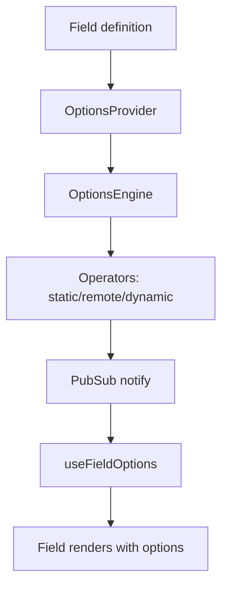

# 📦 Options Module

The Options module dynamically supplies choices (e.g., dropdowns, radio buttons) to fields in your form using a config-driven approach. It supports static lists, remote APIs, and conditionally dynamic endpoints.

## Quick Overview

The module allows you to configure and fetch options for your form fields using three types of sources:
- static: Local array of predefined options.
- remote: Fetch from a static API endpoint.
- remote-dynamic: Fetch from an API endpoint that depends on form values.

Options are managed reactively through a context-powered PubSub system and integrate tightly with react-hook-form.

## Configuration

### Static Options
Provide a hardcoded array of options in the config.
```json
{
  "country": {
    "type": "static",
    "options": [
      { "label": "USA", "value": "us" },
      { "label": "Canada", "value": "ca" },
    ]
  }
}
```

### Remoate Options
Fetch options from a fixed API endpoint.
```json
{
  "cities": {
    "type": "remote",
    "path": "/api/cities",
    "labelKey": "cityName",
    "valueKey": "id",
  }
}
```

### Remote-Dynamic Options
Fetch options from an endpoint that changes based on form field values (e.g., country → cities).
```json
{
  "cities": {
    "type": "remote-dynamic",
    "path": "/api/countries/{COUNTRY}/cities",
    "dependencies": ["COUNTRY"],
    "labelKey": "name",
    "valueKey": "id",
  }
}
```

## Core Components
Wraps your form and injects dynamic options loading logic.
```ts
<OptionsProvider config={optionsConfig}>
  <FormProvider {...instance}>
    <YourForm />
  </FormProvider>
</OptionsProvider>
```
Internally:
* Initializes static and remote sources.
* Watches dependent fields for dynamic updates.
* Publishes results via context.

## OptionsContext
The logic layer that:
* Initializes sources at mount.
* Triggers re-fetch for dynamic sources when dependencies change.

```ts
engine.init(formValues); // run at mount
engine.onDepsChange(['country'], updatedValues); // reactive updates
```

## Hooks
### `useFieldOptions(name: string)`  
Subscribes to a field’s options source and returns current state.

```ts
const { loading, data, error } = useFieldOptions('cities');
```
Use this to populate custom select components.

### `useOptionsContext()`  
Access the full options context API if you need granular control.

## Data Flow Summary


## Example Integration
```tsx
const optionsConfig = {
  carBrands: {
    type: 'remote',
    path: '/api/car-brands',
  },
  carModels: {
    type: 'remote-dynamic',
    path: '/api/brands/{carBrands}/models',
    dependencies: ['carBrands'],
  }
};

<OptionsProvider config={optionsConfig}>
  <FormProvider {...methods}>
    <Select name="carBrands" options={useFieldOptions('carBrands').data} />
    <Select name="carModels" options={useFieldOptions('carModels').data} />
  </FormProvider>
</OptionsProvider>

```